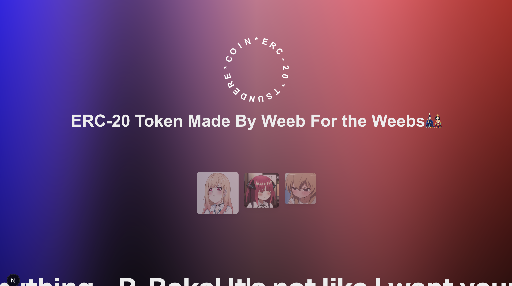
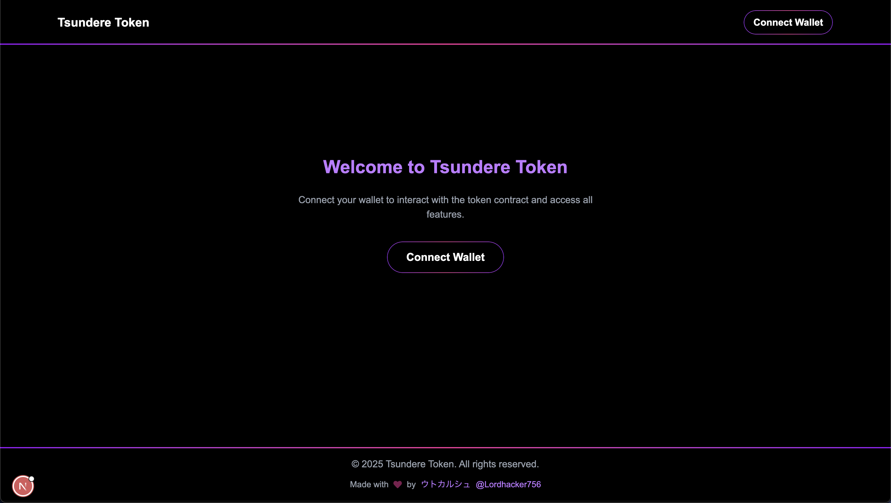
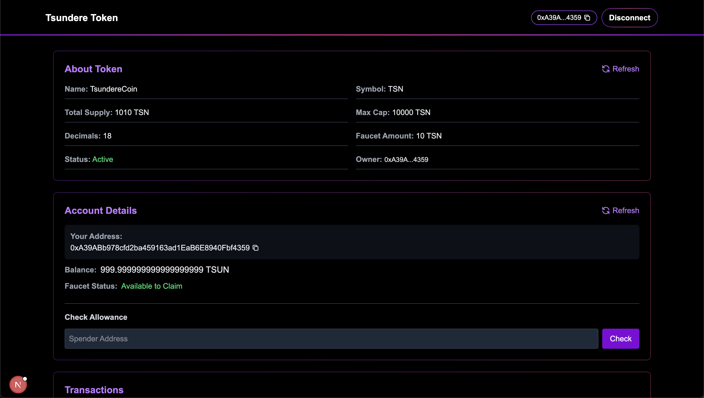
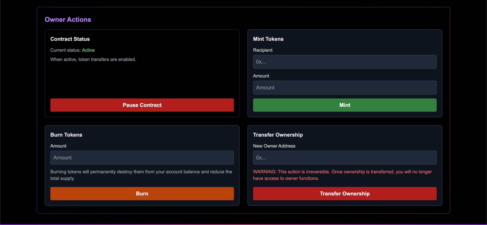

# Tsundere Token (TSN)

A playful ERC-20 token implementation with a tsundere personality - it's not like it wants to be in your wallet or anything... b-baka!



## 🌟 Features

- **Standard ERC-20 Implementation** - Fully compatible with the ERC-20 token standard
- **Pausable** - Contract can be paused in emergency situations
- **Capped Supply** - Maximum supply is capped to prevent inflation
- **Faucet Functionality** - Users can request tokens through a faucet
- **Owner Controls** - Special functions for contract owner:
  - Minting new tokens
  - Burning tokens
  - Pausing/unpausing contract
  - Transferring ownership

## 💻 Tech Stack

- **Frontend**: Next.js, React, TypeScript, Tailwind CSS
- **Blockchain**: Ethereum, MetaMask
- **Smart Contract**: Solidity, ERC-20
- **Libraries**: ethers.js

## 📋 Prerequisites

- Node.js (v18+)
- MetaMask browser extension
- Ethereum wallet with test ETH (for testnet deployment)

## 🚀 Getting Started

### Installation

1. Clone the repository:

```bash
git clone https://github.com/Lordhacker756/ERC-20-Token
cd tsundere-token
```

2. Install dependencies:

```bash
npm install
# or
yarn install
```

3. Start the development server:

```bash
npm run dev
# or
yarn dev
```

4. Open [http://localhost:2345](http://localhost:2345) in your browser.

## 📝 Usage

### Connecting to the Tsundere Token

1. Navigate to the Token page
2. Connect your MetaMask wallet
3. The app will automatically connect to the deployed TSN contract

### User Features

- **View Token Information**: Token name, symbol, total supply, etc.
- **Check Balance**: View your TSN token balance
- **Use Faucet**: Request free TSN tokens (subject to limits)
- **Transfer Tokens**: Send tokens to other addresses

### Owner Features

- **Mint Tokens**: Create new tokens (up to the cap)
- **Burn Tokens**: Remove tokens from circulation
- **Pause/Unpause**: Toggle the contract's paused state
- **Transfer Ownership**: Change the contract owner

## 📄 Contract Details

- **Contract Address**: 0x8A86B7C7b3B8a5FE4c07fC348D91A8f06262c276
- **Network**: Sepolia Testnet
- **View on Etherscan**: [Contract Link](https://sepolia.etherscan.io/address/0x8A86B7C7b3B8a5FE4c07fC348D91A8f06262c276)

## 🖼️ Screenshots

<div style="display: flex; flex-wrap: wrap; gap: 20px;">
  
  
  
  
</div>

## 🤝 Contributing

Contributions, issues and feature requests are welcome!

1. Fork the repository
2. Create a feature branch (`git checkout -b feature/amazing-feature`)
3. Commit your changes (`git commit -m 'Add some amazing feature'`)
4. Push to the branch (`git push origin feature/amazing-feature`)
5. Open a Pull Request

## 📜 License

This project is licensed under the MIT License - see the LICENSE file for details.

## 🙏 Acknowledgements
- ethers.js for blockchain interactions
- Next.js for the frontend framework

